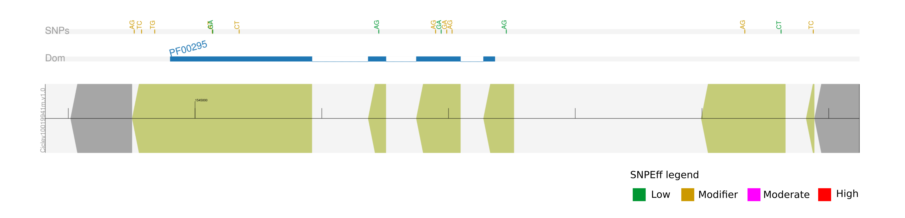

geneplot tutorial
========================

.. toctree::
   :maxdepth: 4

This document describes an example of usage of the Python geneplot library. Input data are located in the “tests” folder of the source code at GitHub. File types include:

1- (mandatory) A GFF file (version v.3) of the annotation of the genome. Verify that the file complies with the standard specifications (https://github.com/The-Sequence-Ontology/Specifications/blob/master/gff3.md).
GFF3 validation tools are available at modENCODE-DCC (https://github.com/modENCODE-DCC/validator).

2- (optional) A VCF file with polymorphisms previously identified, for example with GATK.

Verify that the input VCF file complies with standard specifications (https://github.com/samtools/hts-specs). There are several file verifiers available elsewhere.
The name of the sample on the VCF file must be set accordingly, i.e., at the end of the header line which describes the names of the columns of the VCF file, typically the last one.
See the "w79_w11182w79_UPD" sample name in the next figure of the example data:

.. literalinclude:: tutorial.example.vcf.rst
   :language: rst
   :emphasize-lines: 3

Currently, only single-sample VCF files are accepted by the geneplot library. If you have a multi-sample VCF, you split it with VCFtools or BCFtools.

3- (optional) The output file of InterproScan, which identifies several protein signatures on protein sequence data, in TSV format.

Example 1.
==========

We are going to plot protein domains and SNP data on one ARGONAUTE gene (ID gene:FBgn0262739, trancript ID transcript:FBtr0087613) of the fruit fly (Drosophila melanogaster). According to the GFF3 file, the gene has associated the protein ID FBpp0086739.
We first instantiate a genome object by using the paths of the GFF3, InterproScan output and VCF files as parameters of the genome() class of the library.
The sample VCF file has been downloaded from https://doi.org/10.5281/zenodo.51693.
Next, we instantiate a gene object with the gene() class of the genome object previously created, using the sample ID of the SNPs we want to plot and the protein signature database to be used as parameters of the plot() method of the gene object.

.. code-block:: python
   
   import geneplot as gp
   
   #input data Drosophila genome
   filegff = '/path-to-data/geneplot/tests/fruit_fly.gff3'
   iprfile = '/path-to-data/geneplot/tests/fruit_fly.ipr'
   vcffiles = '/path-to-data/geneplot/tests/'
   
   # class instantiation (genome object)
   genome_1 = gp.genome(filegff, iprfile=iprfile, vcffiles=vcffiles)
   
   # class instantiation (genome object)
   gene_1 = genome_1.gene(mRNAid='transcript:FBtr0087613', proteinid='FBpp0086739')

   # plot
   gene_1.plot('Pfam', sp='w79_w11182w79_UPD', onlycoding=False)

The method uses Pfam database as default. After the first plotting, a list of available database signatures for that gene is printed, in case additional plots are desired. This is the Output image of the example:

.. image:: geneplot.ex.1.png
   :alt: ARGONAUTE gene FBpp0086739

Since SNPEff annotation is not provided in the VCF file for this sample, SNPs are plotted in black color.

Example 2.
==========

We are going to plot protein domains and SNP data on one Pectin lyase-like gene of citrus (ID Ciclev10019941m.g.v1.0, trancript Ciclev10019941m.v1.0). According to the GFF3 file, the gene has associated the protein ID Ciclev10019941m.
WE follow the same method, but in this case we only want to plot SNPs on coding areas of the gene, and they will be colored since SNPEff annotation is provided in the VCF file.

.. code-block:: python
   
   import geneplot as gp
   
   #input data Citrus genome
   filegff = '/path-to-data/geneplot/tests/citrus.gff3'
   iprfile = '/path-to-data/geneplot/tests/citrus.ipr'
   vcffiles = '/path-to-data/geneplot/tests/'
   
   # class instantiation (genome object)
   genome_2 = gp.genome(filegff, iprfile=iprfile, vcffiles=vcffiles)
   
   # class instantiation (genome object)
   gene_2 = genome_2.gene(mRNAid='Ciclev10019941m.v1.0', proteinid='Ciclev10019941m')

   # plot
   gene_2.plot('Pfam', sp='ivia_000', onlycoding=True)

